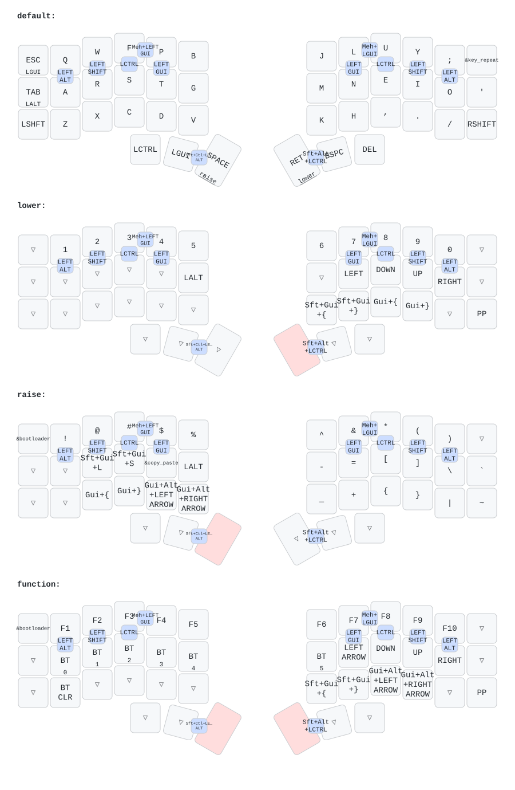

# Config for 3x6 wireless corne LP keyboard

## Layout

I am using typical colemak-dh layout for this board. Rightmost column is currently a bit underutilised, but maybe in the future I will have a better idea how to use it.

## Home-row mods

HRM are set up in the only way that worked for me - by utilizing two keys to trigger them. This is possible due to the fact that this corne uses LP choc switches with LP MBK keycaps and choc spacing, so there are no gaps between the keys.

## Development

I update this config from time to time, when some interesting idea will cross my mind. One such example is `KEY_REPEAT` on the previously unused key in the top right corner, as this is similar to `.` in `neovim`.

## Keymap image

Keymap is automatically generated via github action on every push using very nice visualization package called [keymap-drawer](https://github.com/caksoylar/keymap-drawer), so I can be sure that it is up to date.

